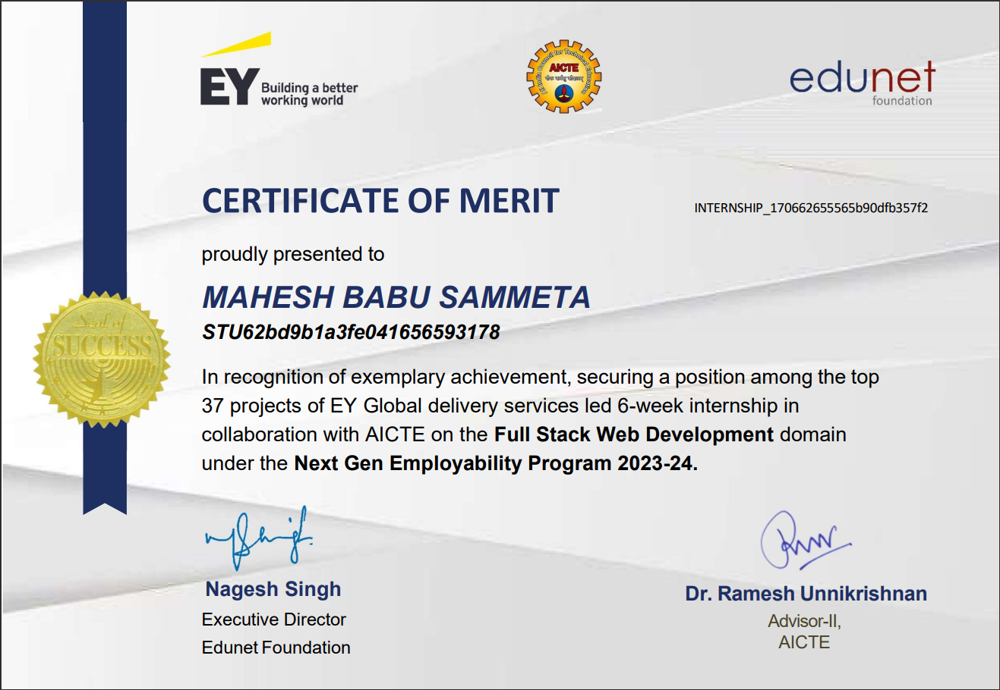
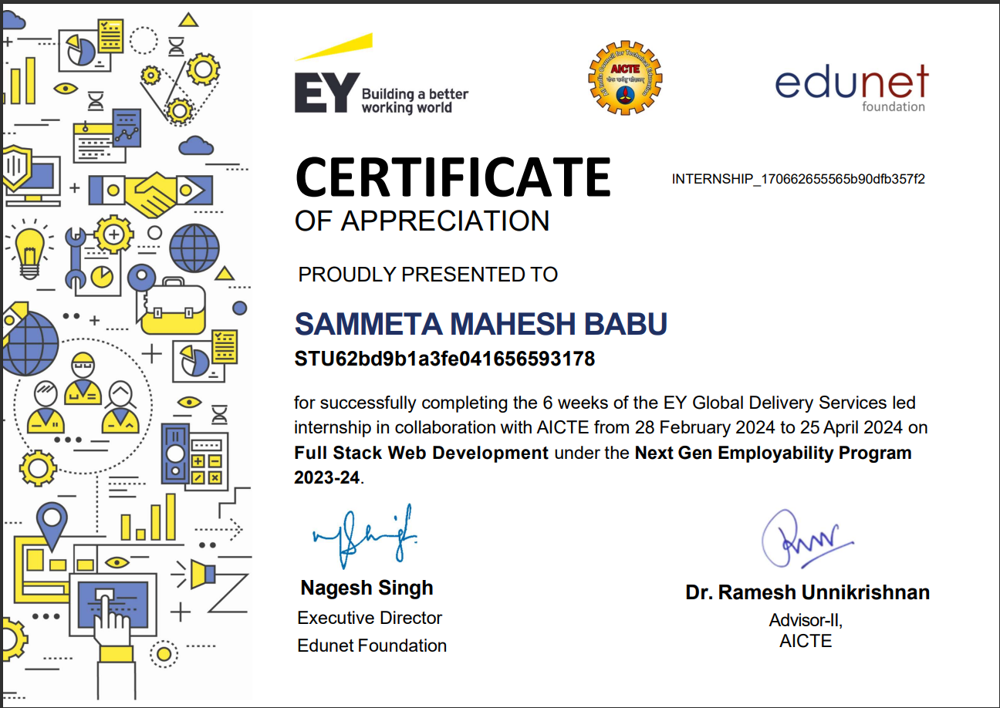
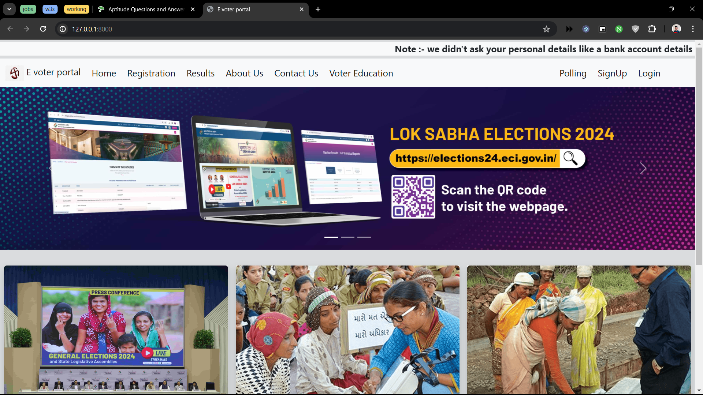
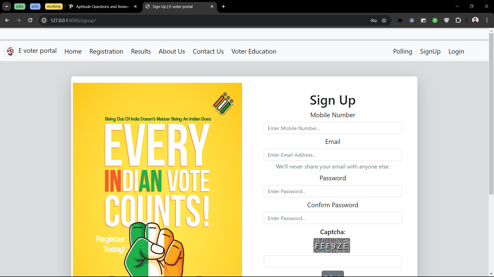
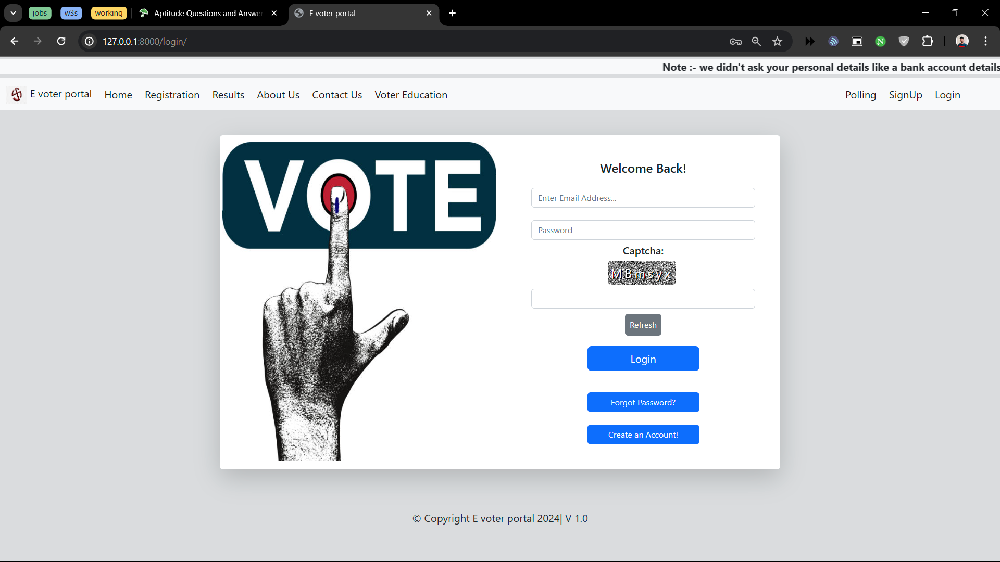
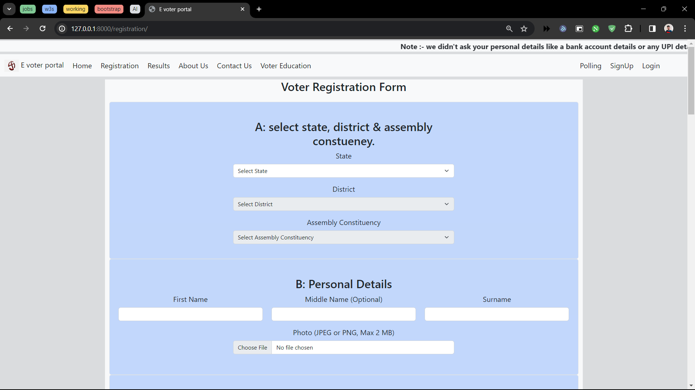
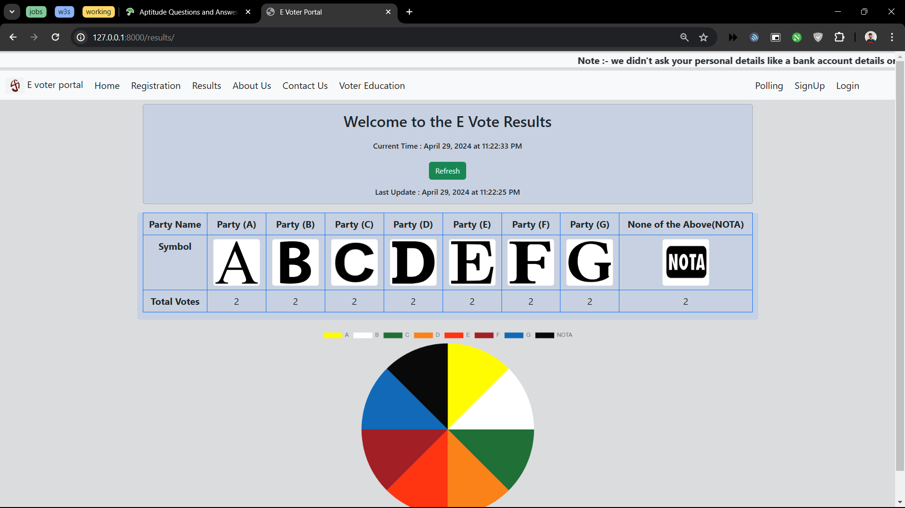

# E Vote India For ECI

## Author

- Name: [Mahesh Babu Sammeta](https://github.com/sammetamaheshbabu)
- GitHut : https://github.com/sammetamaheshbabu
- LinkedIn Profile : https://www.linkedin.com/in/sammetamaheshbabu/
- I'm from Hyderabad, India.
- Date : 30-04-2024

- ### Certificate Of Merit

<p align="center">
    
</p>

- ### Certificate Of Appreciation

<p align="center">
    
</p>

## Table of Contents

1. [Abstract](#abstract)
2. [Problem Statement](#problem-statement)
3. [Project Overview](#project-overview)
4. [Proposed Solution](#proposed-solution)
5. [Technology used](#technology-used)
6. [Installation and Usage](#installation-and-usage)
7. [Results](#results)
8. [Conclusion](#conclusion)
9. [Final Outcome](#final-outcome)
10. [Advantages](#advantages)
11. [Conclusion](#conclusion)
12. [Contact](#contact)

---

## DEMO Video link:

- ### [YouTube](https://youtu.be/zN3QOMUBeR8).

- ### [LinkedIn](https://www.linkedin.com/posts/sammetamaheshbabu_certificateofmerit-fullstackwebdevelopment-activity-7191028378110451712-kaKb?utm_source=share&utm_medium=member_desktop).

---

## Abstract

- Developed Django-based online voting app for Election Commission of India (ECI).
- Compared to traditional methods, it saves costs by eliminating physical polling process and ensures transparency.
- Features like robust authentication, graphical result representation, and following ECI guidelines.
- Addresses drawbacks like manipulation and violence, ensuring peaceful elections.
- Aligns with India's digitalization trend, promoting accessibility and integrity in voting.

## Problem Statement

The traditional voting system in India faces challenges such as inefficiency*, high costs, and high possibilities to manipulation*, need of man power to conduct the elections, raising concerns about the fairness and transparency of elections. <br>
There is a need for a modernized voting approach that improves accessibility, reduces expenses, and ensures the integrity of the electoral process.

## Project Overview

- Our project focuses on developing an online voting application specifically designed for the Election Commission of India (ECI).
- This application streamlines the entire voting process, including registration, authentication, and participation in online polling.
- Utilizing the Django framework, our project ensures a user-friendly interface and strong security measures for transparent and credible elections.
- Key features include robust authentication protocols, graphical representation of voting results, and following to ECI guidelines.

## Proposed Solution

- Our proposed solution entails the development of a user-friendly online voting platform for the Election Commission of India (ECI).
  <br>
- This platform will streamline the entire voting process, including voter registration, authentication, participation and announcement the result.<br>
- To ensure the security and integrity of the electoral process, strong authentication protocols and encryption techniques will be implemented to safeguard voter information. Moreover, compliance with ECI guidelines will be prioritized to maintain transparency and legality.
  <br>
- Additionally, graphical representations such as pie charts and tables will be utilized to present voting results clearly .

## Technology used

- Bootstrap : (Frontend framework)
- HTML
- CSS
- JavaScript
- Canva : (Images and icons)
- Django Framework : (Backend)
- SQLite : (Database)
- Graphical Libraries : (e.g., Chart.js)
- Responsive Design Principles

## Installation And Usage

### Installation

1. Clone the repository:

```bash
$ https://github.com/sammetamaheshbabu/E-Vote-India-For-ECI.git
```

2. Navigate to the project directory:

```bash
$ cd E-Vote-India-For-EC
```

3. To install the Django, use the following command:

```bash
python --version
```

```bash
pip --version
```

```bash
py -m pip install Django
```

### Usage

1. Run the `manage.py` using Python:

```bash
python manage.py runserver
```

2. Starting development server at http://127.0.0.1:8000/

## Results

1. Home Page ( Landing page )

<p align="center">
    
</p>

2. Sign Up page

<p align="center">
    
</p>

3. Login page

<p align="center">
    
</p>

4. New Voter Registration page

<p align="center">
    
</p>

5. Polling page

<p align="center">
    
</p>

6. Results page

<p align="center">
    
</p>

## Final Outcome

The final outcome of the project includes:

- Developed a user-friendly online voting platform for the Election Commission of India (ECI).
- Streamlined the entire voting process, from registration to result announcement.
- Implemented strong security measures to safeguard voter information and ensure integrity.
- Utilized innovative technologies like Django and responsive design principles for modernization.

## Advantages

The E Vote India For EC Project offers several advantages:

- **Cost Efficiency**: Eliminates physical polling costs, reducing expenses for the Election Commission of India (ECI).
- **Enhanced Transparency**: Robust authentication and graphical result representation ensure clear and trustworthy election outcomes.
- **Improved Accessibility**: User-friendly interface enables participation from anywhere with internet access.
- **Security Measures**: Encryption and authentication protocols protect voter data, minimizing risks of manipulation and fraud.
- **Alignment with Digitalization Trends**: Embraces innovative technologies to modernize governmental processes and promote efficiency.

## Conclusion

- In conclusion, our project has successfully introduced a modernized and user-friendly online voting platform tailored for the Election Commission of India (ECI). Leveraging technologies such as Django, SQLite, HTML, CSS, and Bootstrap, we have streamlined the voting process, ensuring accessibility, transparency, and security.
- Looking ahead, for the next version of this project, we plan to implement blockchain authentication to further enhance security and trust in the voting process. Additionally, we aim to incorporate additional security measures to fortify the platform against potential threats. These advancements will reinforce the integrity of the electoral process and continue to promote fair and democratic elections in India.

I especially want to give my thanks to our instructor, [Hari Krishna Sripathi](https://www.linkedin.com/in/shkrishna/).

## Contact

For any inquiries or support, please contact [Linkedin](https://www.linkedin.com/in/sammetamaheshbabu/) ,[Instagram](https://www.instagram.com/sammetamaheshbabu/).

---
